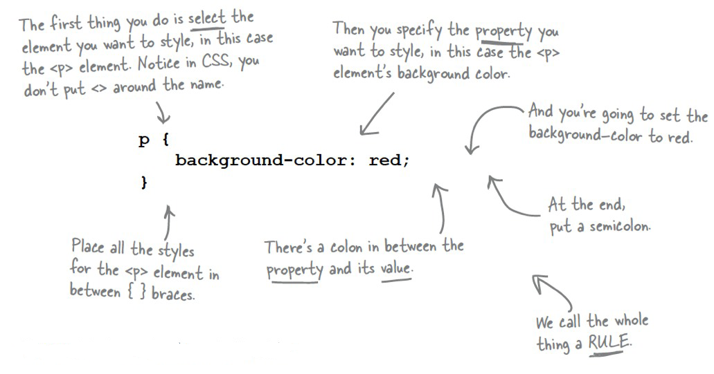

# How It Works
Cascading Style Sheets contain CSS style rules. For example, let us imagine we had paragraph (&lt;p&gt;)  elements on a page, and we wanted to each paragraph have a background colour of red. Here is the code we would add:
~~~
p {
    background-color:red;
}
~~~
Our CSS Rule begins with *p* which is our CSS selector. The selector tells the web browser which HTML element we wish to style.

Next, the word *background-color* is a **property** and *red* is its **value**.

A property and value pair together is called a **declaration**. We create complex style rules by stringing together multiple declarations, which are separated by semicolons. This entire piece of code, including the selector and declarations, is known as a **CSS Rule**.
  Finally, directly preceding, and directly following the declarations we enclose our Rule in curly brackets.

You may have as many properties and values as you like in each CSS rule, as in the following example:
~~~
body {
      color: #0000FF;
      background-color:#FFFFE0;
}
~~~